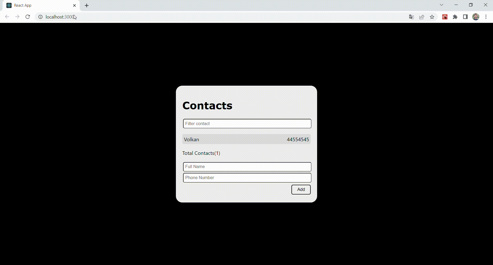

# Contacts App (React)
React.js; I developed with. Gain experience in; Props, States, Life Cycle, Style, Clean code. A copy of telephone directories. Registration takes place by entering a name and number data. The filter has been designed for easy finding of registered people.

## Preview


## Requirements
```
git clone https://github.com/volkantepeli/contacts-app-with-react.git
```
```
npm install
```
```
npm start
```

## Used technologies


<br>
</br>

## Reach out to me

[linkedin]: https://www.linkedin.com/in/volkantepeli/

[][linkedin]